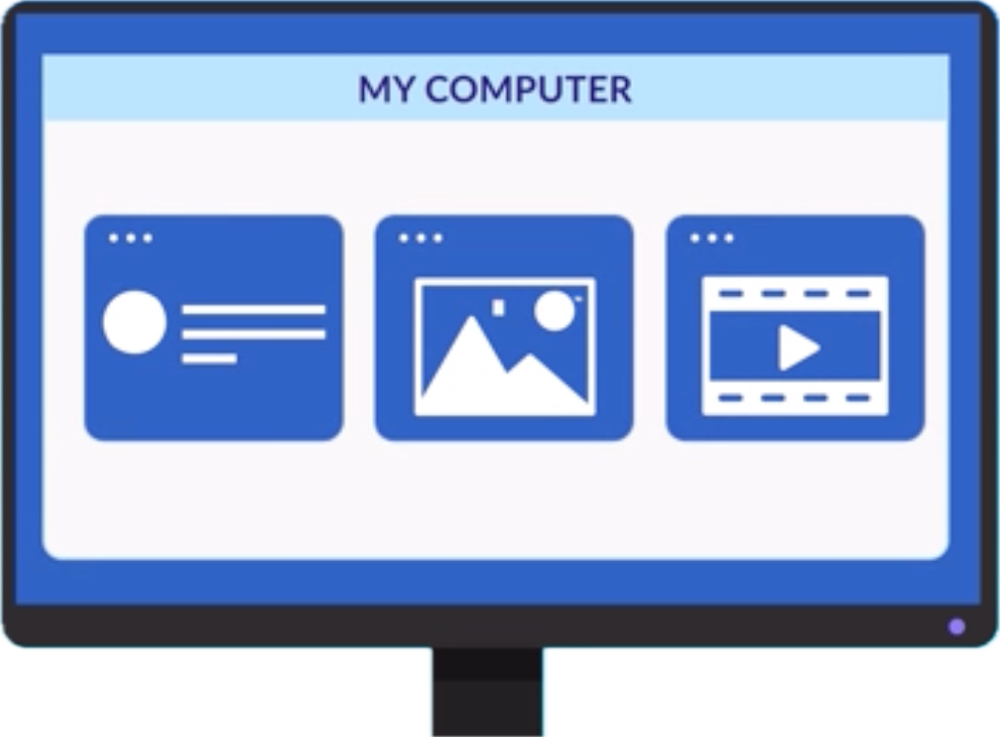
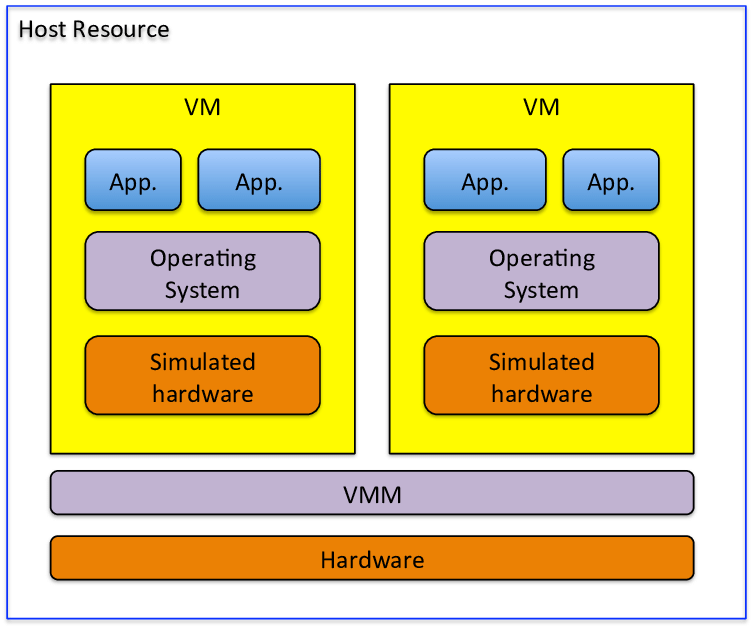
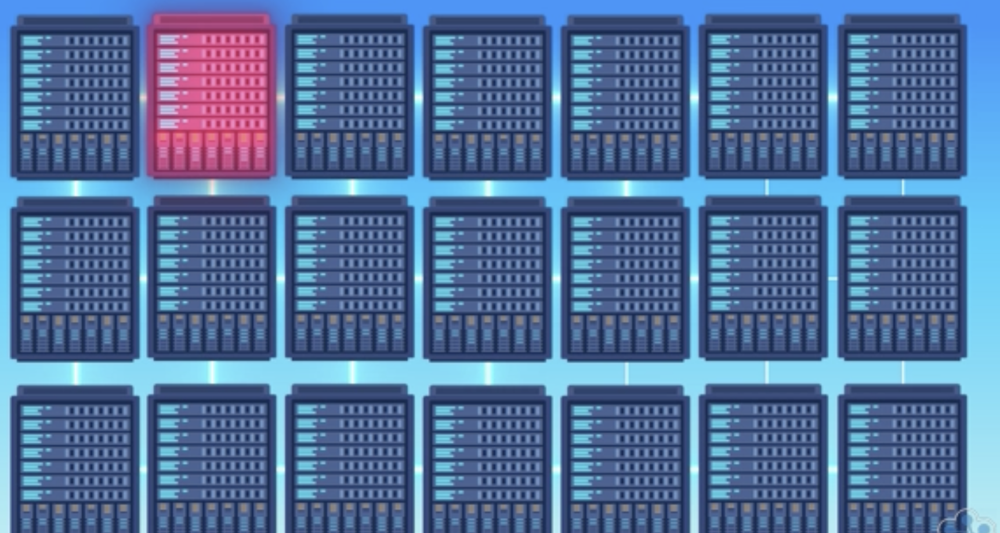
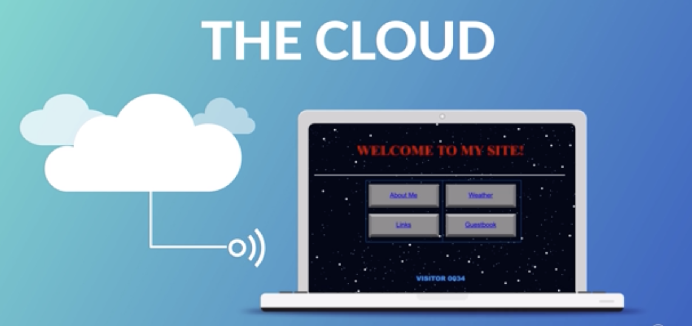
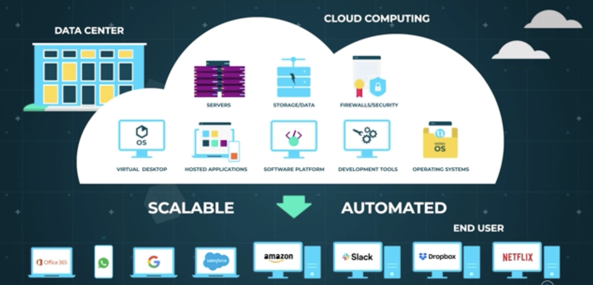
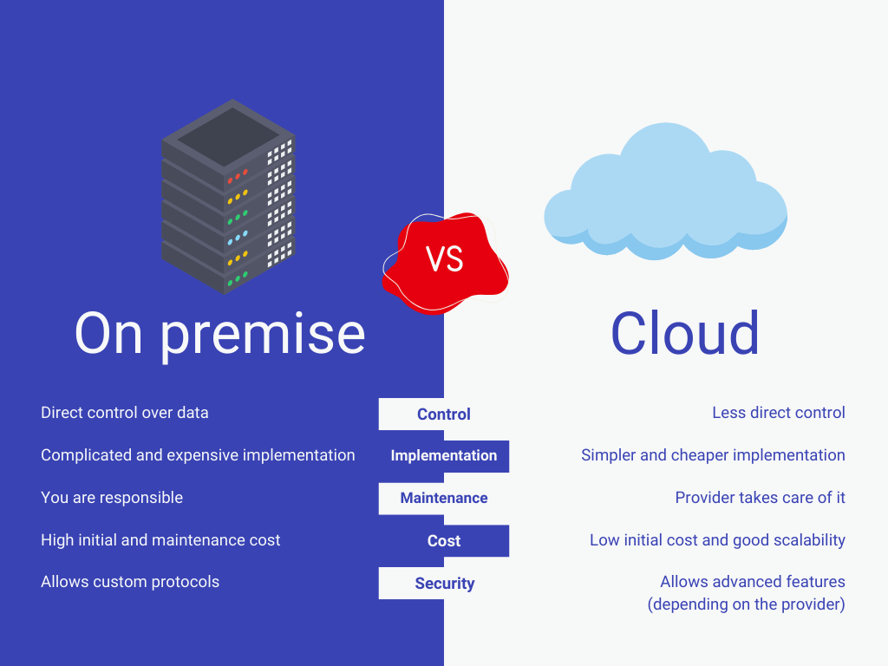
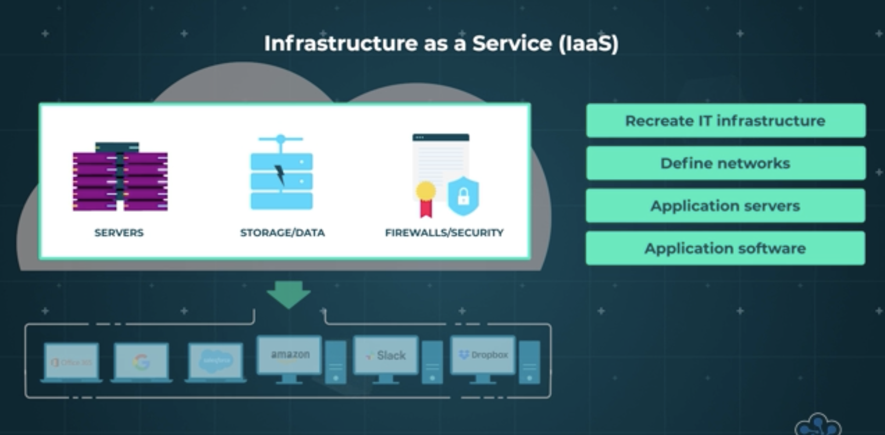
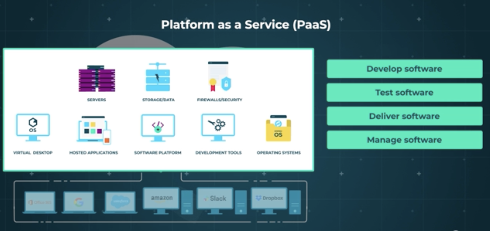

# What is Cloud?

- Whether we know it or not, we are almost likely using the cloud in one way or another. Every time you open your Gmail account, watch a show on Netflix, or check your Instagram, you are using the cloud.

- Before the cloud existed, you might have saved files, pictures, and videos to your hard drive, and used a computer-based application to read your emails.

- Okay, so what exactly is the cloud? **Cloud is just someone else’s computer that you use through the internet. Instead of buying your own server or computer to store data or run applications, you rent computing power, storage, and services from a company over the internet.**
- When data is stored in the cloud, it is actually stored on a server somewhere, and you access it via the internet. So now where are these servers located?

## Data Centers

- Cloud servers are located in data centers all over the world, often called **server farms**. What is Data Centers? A Data Center is a big building full of computers (servers). It contains, Thousands of physical servers, Networking equipment, Storage systems, Cooling systems, Power backup etc.
- A Server is a powerful computer that stores data, runs applications and responds to requests from users. It is a physical machine. E.g your Computer is a physical machine.
- A Virtual Machine (VM) is a software-based computer running inside a physical server. It behaves like its own computer with its own OS, own memory, own CPU, own Storage. But physically, it’s sharing resources of one real server. One physical machine can host many Virtual Machines (VM's)

- A data centers contains many servers, each servers may have many VM's. Virtual Machines act like independent computers.
- If an individual server goes down in data center, this generally doesn't affect the performance of the cloud server, making the system very reliable. Users can connect to the cloud from any device over the internet and can access files and services either through an app or through their browser.

- Cloud computing relies on a technology called virtualization where digital-only virtual computers operate independently inside a physical computer. The technical term is a virtual machine. The beauty of virtual machines is that they are very lightweight, so one physical machine can host many virtual machines.
- Let's look at an example. Say you lose your mobile or it breaks. On it, you have all of your emails, Instagram and Facebook posts and all of your photos. If you weren't using cloud technology, all of this data would be lost along with the phone. But with cloud computing, you know that when you open your accounts on a new or different device, it will still all be in place, with all of your photos, videos, and conversation history saved.
- There are many other benefits to using the cloud. Individuals and companies don't have to manage physical hard drives or servers themselves or run software applications on their own machines. In many cases, you can access your data offline, edit and update files, and then sync it later when you have an internet connection. Colleagues can even collaborate on the same document in real time. Because the remote servers handle most of the computing and storage, you don't necessarily need an expensive high-end machine to get your work done, and data is backed up in multiple locations through a process called redundancy, which means your data won't be lost.
- Every business needs servers and data centers these days, and cloud offers them in a maintenance free, customisable and scalable way. Anyone can use them, from tiny start-ups, to massive global enterprises
- There are some drawbacks to operating in the cloud. Without an internet connection, you can lose access to your data and applications indefinitely. The same applies if there are any technical issues or outages on the server side. Also, because your information is stored online, there is always the risk of cyber attack. Cloud services will have security measures in place so it is generally not an issue, but it's always a good idea to be cautious about what you store in the cloud.

## Why it is Called the Cloud?

- The phrase, the cloud, was first used as slang. When the internet was in its early stages, technical diagrams often used a cloud symbol to represent the servers and networking infrastructure that made up the internet.

- When computing processes began moving to the servers and infrastructure part of the internet, people used the phrase, moving to the cloud, as a way of describing the process. The term stuck, and nowadays the cloud is the term we use to describe this type of computing.

# What is Cloud Computing?

- **Cloud computing is using computing services (like servers, storage, databases, software, analytics and artificial intelligence) over the internet instead of using your own computer or hardware. Instead of buying and managing physical machines, you rent computing power from a cloud provider and access it via the internet.**
- You’re probably using cloud computing right now, even if you don’t realise it. If you use an online service to send emails, edit documents, watch films or TV, listen to music, play games, or store pictures, it’s likely that cloud computing is making it possible.

- The basis of cloud computing is a very large data center that’s full of identical hardware which runs computer services and stores data for multiple user organisations. Generally, services in the data center are easily scalable and the processes for management, deployment and updates are automated.
- It’s basically a way for an organisation to outsource some of their important computer services to a specialist third party cloud provider who invests in hardware and software, can provide it to a large number of customers, and keep it up-to-date and secure for them. And it’s not just about the technology – **organisations only pay for the services they use**, so it’s efficient, cost-effective and scalable as business needs change.

## Why Should we use cloud?

- Organisations don’t have to invest in buying hardware and software, or setting up on-site data centers. It’s what’s known as an **`on-demand service`** so computing resources can be acquired in just a few mouse clicks, and capacity planning is easier.
- The data centers are generally vast and regularly upgraded to run the latest hardware so the maintenance is handled by the cloud provider.
- Data back-up, disaster recovery and business continuity planning is easier and less expensive.
- Cloud providers have policies, technologies and controls which provide a very high level of security to protect data, applications and the overall infrastructure from threats.

# Service Models

- There are two main ways to run applications:

## On-Premises

- On-Premises (On-Prem) means all IT infrastructure (servers, storage, networking) is physically located inside your own office/building and managed by you.
    - You buy everything.
    - You maintain everything.
    - You are responsible for everything.
- On-Premises means hosting and managing IT infrastructure inside your own physical location instead of using cloud services.
- Key Aspects of On-Premises:
    - **Ownership & Responsibility**: The organization purchases, owns, and maintains all hardware and software.
    - **Location**: The infrastructure is located in-house or in a rented local facility, not in a vendor's remote data center.
    - **Maintenance**: Internal IT staff is responsible for updates, security patches, and repairs.
    - **Security & Control**: Offers higher control over data, which is ideal for compliance, security, and specific performance needs

## Cloud

- Cloud Service Models define what level of service the cloud provider gives you. Think of it like, the more responsibility the provider takes, the less you manage.
- You use internet-based services. Inside cloud, you decide how much control you want. If you choose Cloud, then inside cloud you choose:
    - IaaS (Infrastructure as a Service) → If You Want Full Control
    - PaaS (Platform as a Service) → If You Just Want to Deploy Code
    - SaaS (Software as a Service) → If You Just Want to Use Software

- A Simple Analogy:

Imagine opening a restaurant:

- On-Prem → Build building, buy kitchen equipment, hire maintenance.
- IaaS → Rent empty kitchen space, set up your tools.
- PaaS → Rent fully equipped kitchen, just cook.
- SaaS → Order food from Swiggy — just eat.
- Let's look more in detail about Iaas, Paas and Saas

### Iaas (Infrastructure as a Service)

- Infrastructure as a service is the most basic category of cloud computing services and relates to the IT infrastructure. You rent virtualized hardware like servers, storage, and networking, but you are responsible for everything on top of it.
- You Manage → Operating systems, middleware, runtime, data, and applications.
- Provider Manages → Physical servers, networking, virtualization, and storage.
- Through IaaS, an organisation can re-create their IT infrastructure by defining networks in the cloud, having application servers that run inside those networks, and installing and configuring application software on those servers.
- Effectively this is what an organisation would do in their own data centers (On-prem) but instead, they do it in the cloud provider’s data centers. That means the provider takes care of hardware provision but the organisation still has a large degree of control over exactly what software’s running in the cloud.
- Example: AWS EC2 instance. You launch a VM. You install OS, Database and application in it. Cloud provider only gives hardware. Cloud providers like Amazon Web Services, Microsoft Azure, and Google Compute Engine.

### PaaS (Platform as a Service)

- Imagine your organisation needs a database server to capture data from your customer service system. You could use IaaS to create a server and install database management software on it. But you could also leave this to the cloud provider who can provide and configure the resources behind the scenes and give you secure access to those resources.
- PaaS is designed for developers. It provides a pre-configured environment (the "platform") where you can write and deploy code without worrying about managing servers or operating systems.
- You Manage → Only your applications and the data within them.
- Provider Manages → Operating systems, runtime, middleware, and all underlying infrastructure.
- Platform as a service is the model that provides an on-demand environment for developing, testing, delivering and managing software applications using provider-managed building blocks.
- However, whilst this approach means having slightly less control over the configuration of the services, it also means the organisation has less responsibility for the infrastructure that’s running them, freeing them up to focus on adding new features and services rather than maintaining the technical infrastructure.
- Examples:
    - Heroku: A popular platform where a developer can deploy a Node.js or Python application directly from GitHub in minutes without configuring virtual machines.
    - Microsoft Azure App Service: Ideal for developers to host web apps, RESTful APIs, and mobile backends quickly.

### SaaS (Software as a Service)

- SaaS is a finished software product delivered over the internet, typically via a web browser. It is ready-to-use and requires zero technical management from your end. You use a complete software application via internet. You manage nothing Everything is handled by provider.
- Software as a service is the model for delivering software applications on-demand over the Internet, typically on a subscription basis. With SaaS, cloud providers host and manage the software application and underlying infrastructure, and handle any maintenance, like software upgrades and security patching. Users connect to the application over the Internet, usually with a web browser on their phone, tablet or PC.
- Examples:  Microsoft Office 365, Google Apps, Gmail etc.

>[!NOTE] 
> - Most companies may use Cloud or keep On-Prem or a Hybrid Setup. A hybrid cloud setup combines on-premises infrastructure (private cloud/servers) with public cloud services (AWS, Azure, Google Cloud), allowing data and applications to be shared between them