# What is Cloud?

- Whether we know it or not, we are almost likely using the cloud in one way or another. Every time you open your Gmail account, watch a show on Netflix, or check your Instagram, you are using the cloud.

- Before the cloud existed, you might have saved files, pictures, and videos to your hard drive, and used a computer-based application to read your emails.

- Okay, so what exactly is the cloud? **Cloud is just someone else’s computer that you use through the internet. Instead of buying your own server or computer to store data or run applications, you rent computing power, storage, and services from a company over the internet.**
- When data is stored in the cloud, it is actually stored on a server somewhere, and you access it via the internet. So now where are these servers located?

## Data Centers

- Cloud servers are located in data centers all over the world, often called **server farms**. What is Data Centers? A Data Center is a big building full of computers (servers). It contains, Thousands of physical servers, Networking equipment, Storage systems, Cooling systems, Power backup etc.
- A Server is a powerful computer that stores data, runs applications and responds to requests from users. It is a physical machine. E.g your Computer is a physical machine.
- A Virtual Machine (VM) or an instance is a software-based computer running inside a physical server. It behaves like its own computer with its own OS, own memory, own CPU, own Storage. But physically, it’s sharing resources of one real server. One physical machine can host many Virtual Machines (VM's)

- A data centers contains many servers, each servers may have many VM's. Virtual Machines act like independent computers.
- If an individual server goes down in data center, this generally doesn't affect the performance of the cloud server, making the system very reliable. Users can connect to the cloud from any device over the internet and can access files and services either through an app or through their browser.

- Cloud computing relies on a technology called virtualization where digital-only virtual computers operate independently inside a physical computer. The technical term is a virtual machine. The beauty of virtual machines is that they are very lightweight, so one physical machine can host many virtual machines.
- Let's look at an example. Say you lose your mobile or it breaks. On it, you have all of your emails, Instagram and Facebook posts and all of your photos. If you weren't using cloud technology, all of this data would be lost along with the phone. But with cloud computing, you know that when you open your accounts on a new or different device, it will still all be in place, with all of your photos, videos, and conversation history saved.
- There are many other benefits to using the cloud. Individuals and companies don't have to manage physical hard drives or servers themselves or run software applications on their own machines. In many cases, you can access your data offline, edit and update files, and then sync it later when you have an internet connection. Colleagues can even collaborate on the same document in real time. Because the remote servers handle most of the computing and storage, you don't necessarily need an expensive high-end machine to get your work done, and data is backed up in multiple locations through a process called redundancy, which means your data won't be lost.
- Every business needs servers and data centers these days, and cloud offers them in a maintenance free, customisable and scalable way. Anyone can use them, from tiny start-ups, to massive global enterprises
- There are some drawbacks to operating in the cloud. Without an internet connection, you can lose access to your data and applications indefinitely. The same applies if there are any technical issues or outages on the server side. Also, because your information is stored online, there is always the risk of cyber attack. Cloud services will have security measures in place so it is generally not an issue, but it's always a good idea to be cautious about what you store in the cloud.

### Availability zone (AZ)

- An availability zone (AZ) is a physically and logically isolated, highly available data center or group of data centers within a cloud provider's region. Each zone has independent, redundant power, cooling, and network connectivity. 
- They are designed to protect against localized disasters and failures.
- A data center is the physical building/facility housing IT infrastructure. An availability zone is a structural, fault-tolerant logical grouping of those data centers.
- Key features include:
    - **Physical Separation**: AZs within a region are physically separated by a meaningful distance (usually within 100 km) to prevent simultaneous failures from issues like power outages or natural disasters.
    - **Low-Latency Connectivity**: They are connected via high-bandwidth, low-latency private networking, enabling rapid, synchronous replication between zones.
    - **Fault Tolerance**: If one AZ fails, services can fail over to another, ensuring high availability (HA) for applications.
    - **Components**: An AZ can be a single,, dedicated datacenter, but is often comprised of multiple datacenters.
- In real-time scenarios, AZ help in the following ways:
    - **Instant Failover**: If a primary data center suffers a sudden power outage or hardware failure, the system can automatically switch (failover) to a backup instance in a different AZ without the end-user noticing any downtime.
    - **Ultra-Low Latency**: AZs are connected via high-speed, private fiber-optic networks, often with a round-trip latency of less than 2 milliseconds. This is critical for real-time applications like online gaming, video streaming, and financial trading.
    - **Synchronous Replication**: Because they are close to each other (typically within 100 km), data can be written to multiple zones simultaneously (synchronously). This ensures that if one zone fails, no data is lost between the moment of failure and the recovery.
    - **No-Interruption Maintenance**: Cloud providers can perform updates or patches in one AZ at a time. By spreading your application across multiple zones, your service remains online and responsive even while the underlying infrastructure is being maintained.
    - **Zero I/O Delays**: For databases, backups can be taken from a "standby" instance in a different AZ. This prevents the "real-time" performance of your primary database from slowing down during the backup process.

## Why it is Called the Cloud?

- The phrase, the cloud, was first used as slang. When the internet was in its early stages, technical diagrams often used a cloud symbol to represent the servers and networking infrastructure that made up the internet.

- When computing processes began moving to the servers and infrastructure part of the internet, people used the phrase, moving to the cloud, as a way of describing the process. The term stuck, and nowadays the cloud is the term we use to describe this type of computing.

# What is Cloud Computing?

- **Cloud computing is using computing services (like servers, storage, databases, software, analytics and artificial intelligence) over the internet instead of using your own computer or hardware. Instead of buying and managing physical machines, you rent computing power from a cloud provider and access it via the internet.**
- You’re probably using cloud computing right now, even if you don’t realise it. If you use an online service to send emails, edit documents, watch films or TV, listen to music, play games, or store pictures, it’s likely that cloud computing is making it possible.

- The basis of cloud computing is a very large data center that’s full of identical hardware which runs computer services and stores data for multiple user organisations. Generally, services in the data center are easily scalable and the processes for management, deployment and updates are automated.
- It’s basically a way for an organisation to outsource some of their important computer services to a specialist third party cloud provider who invests in hardware and software, can provide it to a large number of customers, and keep it up-to-date and secure for them. And it’s not just about the technology – **organisations only pay for the services they use**, so it’s efficient, cost-effective and scalable as business needs change.

## Why Should we use cloud?

- Organisations don’t have to invest in buying hardware and software, or setting up on-site data centers. It’s what’s known as an **`on-demand service`** so computing resources can be acquired in just a few mouse clicks, and capacity planning is easier.
- The data centers are generally vast and regularly upgraded to run the latest hardware so the maintenance is handled by the cloud provider.
- Data back-up, disaster recovery and business continuity planning is easier and less expensive.
- Cloud providers have policies, technologies and controls which provide a very high level of security to protect data, applications and the overall infrastructure from threats.

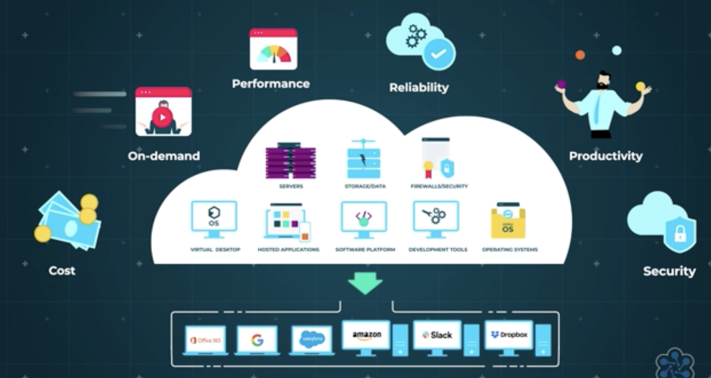

# Service Models

- There are two main ways to run applications:

## On-Premises

- On-Premises (On-Prem) means all IT infrastructure (servers, storage, networking) is physically located inside your own office/building and managed by you.
    - You buy everything.
    - You maintain everything.
    - You are responsible for everything.
- On-Premises means hosting and managing IT infrastructure inside your own physical location instead of using cloud services.
- Key Aspects of On-Premises:
    - **Ownership & Responsibility**: The organization purchases, owns, and maintains all hardware and software.
    - **Location**: The infrastructure is located in-house or in a rented local facility, not in a vendor's remote data center.
    - **Maintenance**: Internal IT staff is responsible for updates, security patches, and repairs.
    - **Security & Control**: Offers higher control over data, which is ideal for compliance, security, and specific performance needs

## Cloud

- Cloud Service Models define what level of service the cloud provider gives you. Think of it like, the more responsibility the provider takes, the less you manage.
- You use internet-based services. Inside cloud, you decide how much control you want. If you choose Cloud, then inside cloud you choose:
    - IaaS (Infrastructure as a Service) → If You Want Full Control
    - PaaS (Platform as a Service) → If You Just Want to Deploy Code
    - SaaS (Software as a Service) → If You Just Want to Use Software

- A Simple Analogy:

Imagine opening a restaurant:

- On-Prem → Build building, buy kitchen equipment, hire maintenance.
- IaaS → Rent empty kitchen space, set up your tools.
- PaaS → Rent fully equipped kitchen, just cook.
- SaaS → Order food from Swiggy — just eat.
- Let's look more in detail about Iaas, Paas and Saas

### Iaas (Infrastructure as a Service)

- Infrastructure as a service is the most basic category of cloud computing services and relates to the IT infrastructure. You rent virtualized hardware like servers, storage, and networking, but you are responsible for everything on top of it.
- You Manage → Operating systems, middleware, runtime, data, and applications.
- Provider Manages → Physical servers, networking, virtualization, and storage.
- Through IaaS, an organisation can re-create their IT infrastructure by defining networks in the cloud, having application servers that run inside those networks, and installing and configuring application software on those servers.
- Effectively this is what an organisation would do in their own data centers (On-prem) but instead, they do it in the cloud provider’s data centers. That means the provider takes care of hardware provision but the organisation still has a large degree of control over exactly what software’s running in the cloud.
- Example: AWS EC2 instance. You launch a VM. You install OS, Database and application in it. Cloud provider only gives hardware. Cloud providers like Amazon Web Services, Microsoft Azure, and Google Compute Engine.

### PaaS (Platform as a Service)

- Imagine your organisation needs a database server to capture data from your customer service system. You could use IaaS to create a server and install database management software on it. But you could also leave this to the cloud provider who can provide and configure the resources behind the scenes and give you secure access to those resources.
- PaaS is designed for developers. It provides a pre-configured environment (the "platform") where you can write and deploy code without worrying about managing servers or operating systems.
- You Manage → Only your applications and the data within them.
- Provider Manages → Operating systems, runtime, middleware, and all underlying infrastructure.
- Platform as a service is the model that provides an on-demand environment for developing, testing, delivering and managing software applications using provider-managed building blocks.
- However, whilst this approach means having slightly less control over the configuration of the services, it also means the organisation has less responsibility for the infrastructure that’s running them, freeing them up to focus on adding new features and services rather than maintaining the technical infrastructure.
- Examples:
    - Heroku: A popular platform where a developer can deploy a Node.js or Python application directly from GitHub in minutes without configuring virtual machines.
    - Microsoft Azure App Service: Ideal for developers to host web apps, RESTful APIs, and mobile backends quickly.

### SaaS (Software as a Service)

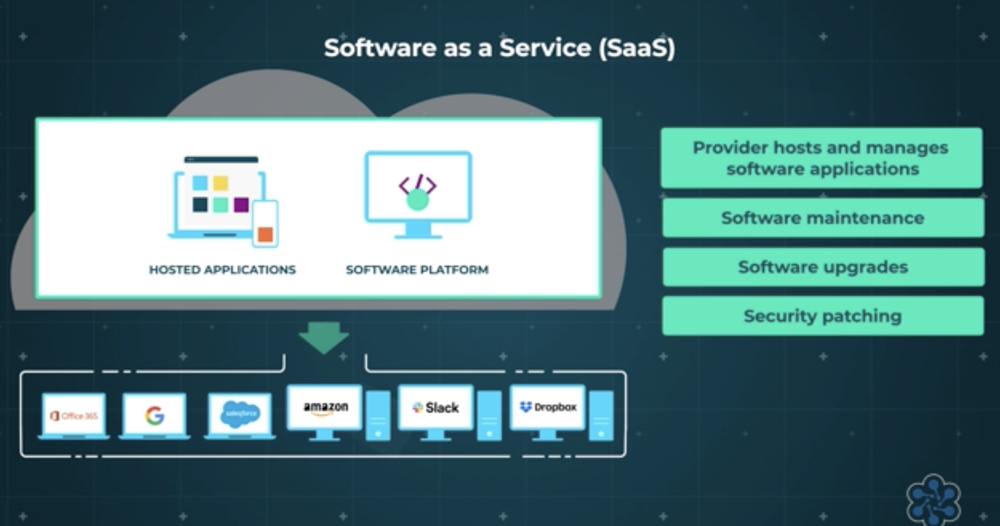

- SaaS is a finished software product delivered over the internet, typically via a web browser. It is ready-to-use and requires zero technical management from your end. You use a complete software application via internet. You manage nothing Everything is handled by provider.
- Software as a service is the model for delivering software applications on-demand over the Internet, typically on a subscription basis. With SaaS, cloud providers host and manage the software application and underlying infrastructure, and handle any maintenance, like software upgrades and security patching. Users connect to the application over the Internet, usually with a web browser on their phone, tablet or PC.
- Examples:  Microsoft Office 365, Google Apps, Gmail etc.

>[!TIP]
> - Platform as a service (PaaS) is commonly used for developing, testing, delivering and managing software applications. 
> - IaaS is typically used for recreating an organization's IT infrastructure, while SaaS is used to deliver software applications on-demand, typically on a subscription basis. 

# Deployment Models

## Public vs Private vs Hybrid vs Community Cloud

### Public Cloud

- Public cloud resources are owned by a cloud provider and shared across multiple customers. The physical hardware is shared. But each customer’s data and applications are logically isolated (separated securely). Customers cannot see each other’s data.
- It is a cloud computing environment where third-party providers offer services to multiple customers over the public or shared Internet.
- In this model, the cloud provider owns and operates the infrastructure (data centers, servers, networks, etc.) and delivers these resources as a fully managed service to multiple users referred to as tenants. This means many tenants share the same hardware resources, while their data and workloads remain logically isolated. Public cloud services are typically delivered on a pay-as-you-go or subscription model, allowing users to scale usage up or down easily.
- Examples of Public Cloud: Amazon Web Services (AWS), Microsoft Azure, and Google Cloud Platform (GCP)

### Private Cloud

- This is a cloud computing environment that is used exclusively by one organization, and the infrastructure is either hosted on-premises within the organization’s own data center or on dedicated hardware at a third-party hosting facility. In both cases, the resources are not shared with any other organization. 
- Essentially, it’s an isolated cloud environment behind a company’s firewall or on a private network, offering cloud benefits (such as virtualization, scalability, self-service) but with greater control and privacy.
- Private cloud resources are dedicated to only one organization. That means:
    - Infrastructure is used by only one company
    - Not shared with other customers
    - Can be hosted on-prem or in provider’s data center
    - There are 2 types of Private Cloud:
        - **On-Prem Private Cloud** - Similar to On-Prem servers. The company:
            - Owns the servers
            - Keeps them inside their building
            - Uses virtualization
            - Creates internal cloud system
            - Entirely managed by internal IT staff.
        - **Hosted Private Cloud** - Infrastructure is:
            - Hosted in a provider’s data center
            - But dedicated only for one company
            - No sharing with others.

- In a private cloud, maintenance responsibility depends on the deployment model chosen by the organization. It can be handled by either the organization's internal IT team or a third-party provider, and in some cases, a mixture of both.
    - **On-Premises Private Cloud:** Maintenance is done by the owning organization. They own, manage, and maintain all hardware and software within their own data center.
    - **Hosted Private Cloud:** Maintenance is done by a third-party provider. The infrastructure is located off-premises in a vendor's data center, and the provider manages the hardware, software, and security patches.

- Examples of Private Cloud: Microsoft Azure Stack, allowing organizations to run a version of Azure services on their own hardware. Another example is using OpenStack, an open-source cloud platform, to deploy a private cloud on-premises

>[!IMPORTANT]
> - Private Cloud does NOT automatically mean On-Prem. On-Prem = You own and manage everything physically.
> - Private Cloud = Dedicated cloud environment for one company (can be on-prem or hosted).

### Community Cloud

- A Community Cloud is a cloud infrastructure shared by multiple organizations that have similar requirements, policies, or goals.
- A community cloud is a collaborative, multi-tenant infrastructure shared among several organizations with common goals, such as security, compliance, or industry-specific needs. It provides a middle ground between private and public clouds, offering enhanced security and shared costs for sectors like government, healthcare, or finance.
- It is not open to everyone like Public Cloud.
- It is not dedicated to only one organization like Private Cloud. It is shared — but only within a specific group (community).
- Example: Several government departments Or multiple hospitals Or a group of banks They all:
    - Must follow strict compliance rules
    - Need secure infrastructure
    - Want cost sharing
- So they create a cloud environment only accessible to that group. That is Community Cloud.
- Cost-effective compared to private clouds, more secure than public clouds, and highly scalable.

### Hybrid Cloud

- Many organizations use a Hybrid Cloud, which combines both public and private clouds. This allows sensitive data to be kept in a secure private environment while non-critical tasks leverage the cost-effective scalability of the public cloud
- The hybrid cloud deployment model occurs when an organization uses two or more deployment models: private cloud, public cloud, or community cloud.

>[!NOTE]
> - Most companies may use Cloud or keep On-Prem or a Hybrid Setup. A hybrid cloud setup combines on-premises infrastructure (private cloud/servers) with public cloud services (AWS, Azure, Google Cloud), allowing data and applications to be shared between them.

| Aspect                       | Public Cloud                                        | Private Cloud                                   | Hybrid Cloud                                    | Community Cloud                                               |
| ---------------------------- | --------------------------------------------------- | ----------------------------------------------- | ----------------------------------------------- | ------------------------------------------------------------- |
| **Resource Ownership**       | Owned by cloud provider                             | Dedicated to one organization                   | Mix of public + private                         | Shared by multiple organizations with common requirements     |
| **Resource Sharing**         | Shared physical infrastructure (logically isolated) | Not shared with other organizations             | Some shared, some dedicated                     | Shared only within a specific group of organizations          |
| **Security Control**         | Standard security provided by provider              | High control over security policies             | Flexible — sensitive workloads can stay private | Strong security tailored to community standards               |
| **Maintenance**              | Managed mostly by provider                          | Managed by organization (or dedicated provider) | Mixed responsibility                            | Shared responsibility or managed by third-party provider      |
| **Cost / Pricing**           | Pay-as-you-use, lower upfront cost                  | Higher cost (dedicated resources)               | Moderate — optimized cost strategy              | Cost shared among participating organizations                 |
| **Scalability**              | Highly scalable, on-demand                          | Limited by owned capacity                       | Scalable using public part                      | Moderate scalability depending on shared infrastructure       |
| **Control Level**            | Less infrastructure control                         | Full control over infrastructure                | Balanced control                                | More control than public, less than fully private             |
| **Customization**            | Limited customization                               | Highly customizable                             | Moderate customization                          | Customizable based on shared policies                         |
| **Compliance & Regulations** | May be challenging for strict regulations           | Easier to meet strict compliance needs          | Sensitive data can stay private                 | Designed to meet shared compliance or regulatory requirements |
| **Business Suitability**     | Startups, web apps, fast-growing businesses         | Large enterprises, banks, healthcare            | Enterprises needing flexibility + compliance    | Government bodies, healthcare groups, financial consortiums   |
| **Deployment Speed**         | Very fast                                           | Slower setup                                    | Medium                                          | Moderate — depends on shared governance                       |
| **Risk Handling**            | Dependent on provider’s uptime                      | Organization responsible                        | Can distribute risk                             | Risk shared across participating organizations                |

# Service vs Deployment Model

- Deployment Models – Define where and how infrastructure is hosted (Public, Private, Hybrid, Community).
- Service Models – Define the level of responsibility between provider and consumer (IaaS, PaaS, SaaS).
- Cloud deployment models define the infrastructure's location, ownership, and security (Public, Private, Hybrid), while service models (IaaS, PaaS, SaaS) define the level of management and type of resources provided to the user. Together, they dictate, respectively, where the cloud operates and what is consumed.
- You choose:
    - A Deployment Model (Public / Private / Hybrid)
    - A Service Model (IaaS / PaaS / SaaS)
- Example combinations:
    - Public + IaaS
    - Public + SaaS
    - Private + IaaS
    - Hybrid + PaaS
- They combine depending on business need.

## Benefits of Cloud Services

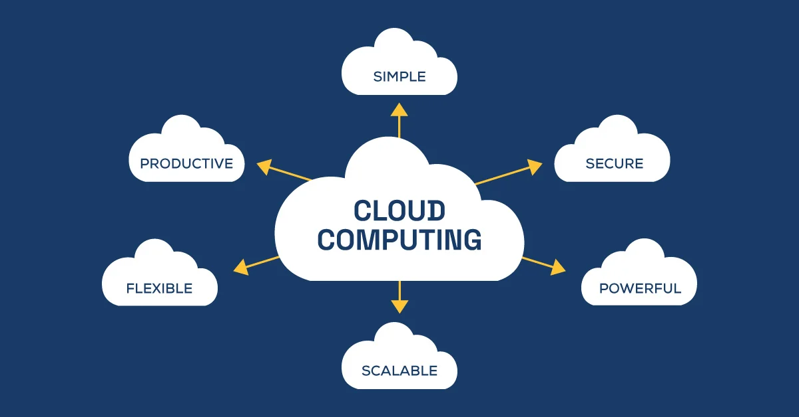

- Let’s see how cloud services can benefit an organization:

#### Flexibility

- Cloud services are flexible because they’re **available on-demand**, you only pay for what you use, services are scalable, there are economies of scale and there’s a lot of choice. On-demand services mean that, if you want a resource, you can get it almost immediately and allocate it where you need it. This might mean more server capacity or application user licenses. There’s no waiting around for hardware to be ordered, installed, cabled, and configured before you can use it.

#### Utility Pricing

- **You only pay for what you use which is known as utility pricing**. Utility pricing in the cloud is, you only pay for resources when you use them because they’re on-demand and utility-priced.
- Typically within a data center, your infrastructure is up and running 24 X 7 X 365 days, always running, always on, but not always utilized. The power on coiling costs alone for this infrastructure can be phenomenal over the year, especially when you're talking hundreds or even thousands of servers. Wouldn't it be great if you could just go along and switch off the servers when you're not using them? Well, in essence you could, but it rarely occurs, and even if you did, you'd still be paying for the footprint space that those servers took up.
- The cloud offers you the ability to shut down any instance that isn't in use. At that point you instantly stop paying for that resource. This could even be scripted. So for example, at 6:00 p.m. every day, all test and development servers are switched off, and then turned back on again at 8:00 a.m. the next morning.

#### Scalability

- Cloud computing means resources can be **scaled up and down depending on your demand** for applications and services. This can mean altering the power and performance of the resources, perhaps through more memory power, or increasing or reducing the number of resources you're using – like servers and user applications.
- The option to scale resources is important at times when the IT infrastructure takes a heavier amount of traffic than at other times. Think of things like online services that help people to fill in their tax returns which hit a bottleneck towards the end of April, or a new online game is being released and the demand is not accurately known.
- In a classic data center environment, the organisation would need to provision their storage database and network capacity to reflect this additional traffic. There will be additional costs for this extra infrastructure and it might only be used for a couple of months of the year – or not at all. The cloud can be used to traffic burst by scaling resources up when they’re needed and reducing them again when they’re not.

##### Types of Scalability

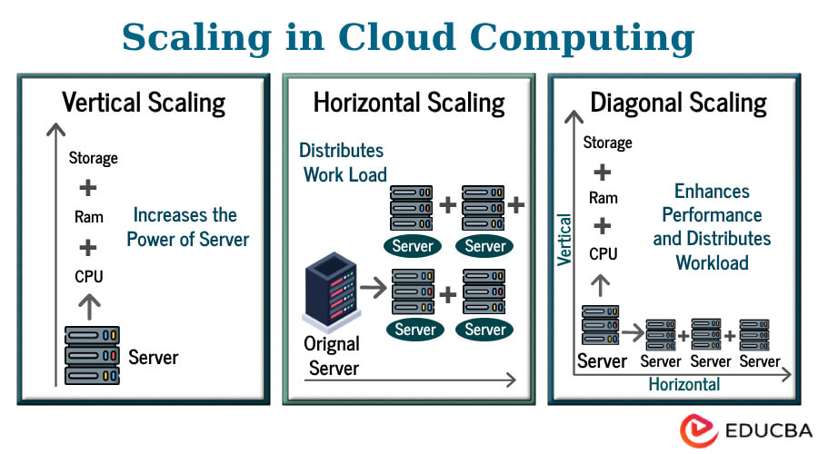

###### Vertical Scaling (Scaling Up/Down)

- Vertical scaling means **increasing or decreasing the power of a single server**. Involves adding more power to an existing server, such as upgrading its CPU, RAM, or storage capacity.
- It is ideal for legacy systems or monolithic applications that cannot easily distribute their load.
- Example: You are running a database on a virtual machine with 4 GB RAM & 2 CPUs. Your application becomes slow because more users are accessing it. You upgrade it to 16 GB RAM & 8 CPUs
- When is it useful?
    - It is **best for simple, low-latency needs, legacy applications, or databases that struggle with distribution**.
    - For applications that can’t easily run on multiple servers
    - When simplicity is preferred
- Limitation:
    - **Hardware Maximums**: Every server has a physical limit; eventually, no larger machine can be purchased.
    - **Single Point of Failure (SPOF)**: If the server fails, the entire application goes down.
    - **Downtime During Upgrades**: Replacing or upgrading hardware often requires restarting or shutting down the machine.
    - **High Costs at Scale**: Upgrading to top-tier hardware becomes extremely expensive compared to adding smaller, cheaper nodes.

###### Horizontal Scaling (Scaling Out/In)

- Horizontal scaling **means adding or removing more servers instead of increasing the power of one server**. 
- Entails adding more instances or nodes (like virtual machines) to your infrastructure to distribute the workload across multiple machines. This approach is better for high availability and fault tolerance.
- Example: Your website runs on 1 server. Traffic increases, so you add more servers. Now traffic is distributed across all servers using a load balancer.
- When it is Useful?
    - **Rapidly Increasing Traffic**: Ideal for web applications and microservices needing to handle fluctuating or high-volume concurrent user traffic.
    - **High Availability & Fault Tolerance**: If one node fails, others continue running, ensuring minimal downtime and improved resilience.
    - **Long-Term Growth**: Unlike vertical scaling (which has hardware limits), horizontal scaling allows adding more capacity indefinitely.
    - **Distributed Processing**: Suitable for big data, analytics, and content delivery networks (CDNs) that can process tasks in parallel.
    - **Cost Efficiency (Long-Term)**: While initial setup can be higher, it often proves cheaper over time by allowing the use of commodity hardware rather than expensive, specialized servers. 
- Limitations:
    - **Architectural Complexity**: Requires designing applications to be stateless or distributed, making it much harder to implement than simply upgrading one machine.
    - **Data Consistency Issues**: Distributing data across multiple nodes can create challenges with ensuring data is synchronized (consistency), often requiring complex databases.
    - **Increased Management Overhead**: Managing, monitoring, and automating a large fleet of servers requires specialized tools and skilled staff.
    - **Network Latency**: Communication between distributed nodes can introduce latency that does not exist in single-machine setups.
    - **Not Suitable for All Applications**: Applications needing heavy, single-threaded computing or tight coupling of components might not benefit. 

###### Diagonal/Hybrid Scaling

- Diagonal scaling is a **combination of vertical and horizontal scaling**. You first **increase the power of a server (vertical), and when that limit is reached, you start adding more servers (horizontal)**.
- A combination of both vertical and horizontal scaling. A system might first scale vertically to maximize existing server capacity and then scale horizontally to handle further growth.
- Example: You upgrade your server from 4GB to 16GB RAM (vertical). Later, traffic grows further, so you add 3 more servers (horizontal).
- When it is Useful?
    - **Handling Variable Workloads**: It is ideal for businesses facing unpredictable traffic spikes, allowing them to scale up for immediate performance needs and out for long-term growth.
    - **Optimizing Costs and Performance**: By scaling vertically first (cheaper initially) and adding horizontal nodes when hardware limits are reached, it balances cost-efficiency with high performance.
    - **Database Management**: It is effective for stateful applications (e.g., SQL databases) that require high performance on individual nodes but also need to handle increased read/write demand through replicas.
    - **Avoiding Bottlenecks**: It prevents systems from being throttled by enhancing individual server power while expanding infrastructure. 
- Limitations: 
    - **Increased Complexity**: Implementing both vertical and horizontal scaling requires more sophisticated management compared to choosing just one method.
    - **Management Overhead**: It requires monitoring both the capacity of individual servers and the coordination of the overall cluster, which can lead to higher operational overhead.
    - **Risk of Inefficiency**: If not properly configured, it can lead to wasted resources (too much capacity) or inadequate performance (too little capacity).
    - **Initial Cost**: While cost-effective in the long run, it can have higher initial setup costs compared to simple, one-dimensional scaling

>[!TIP]
> - Simple Decision Guide
> - If your app:
>   - Is simple and small → Vertical scaling is fine.
>   - Needs high availability → Use Horizontal scaling.
>   - Is growing rapidly → Use Diagonal scaling.
>   - Must survive server failure → Horizontal scaling is necessary.
>   - Cannot be distributed easily → Vertical scaling.

>[!NOTE]
> - In modern cloud architecture Horizontal scaling is preferred because it supports:
>   - High availability
>   - Fault tolerance
>   - Elasticity
>   - Microservices architecture

#### Economies of scale

- Cloud providers benefit from economies of scale because of the huge number of resources they buy to provide services to the customers they support. Because these services run on a common infrastructure, shared between all the customers, each organisation benefits from lower resource costs.

#### Elasticity

- This relates to the amount of choice cloud services provide an organisation to fully customise their IT environment, and then lets them use only the resources they require.
- Cloud elasticity is the ability of a cloud system to **automatically and dynamically provision or deprovision computing resources**—such as CPU, memory, and storage—in real-time to match fluctuating workload demands. It enables organizations to scale resources up/down or in/out, ensuring optimal performance without over-provisioning, which lowers costs.
- Elasticity is actually a special form of scalability that happens automatically and dynamically.

>[!IMPORTANT]
> ##### Difference Between Scalability and Elasticity
> - Scalability means the system can handle more load by increasing its capacity.
> - Elasticity means the system can automatically increase and decrease capacity depending on demand
> - Scalability is the ability of a system to handle increased workload by adding more resources, either manually or automatically, and it mainly focuses on growth. Elasticity, on the other hand, is the ability of a cloud system to automatically adjust resources up and down based on real-time demand. In simple terms, scalability is about capacity expansion, while elasticity is about dynamic adjustment. 
> - Scalability ensures your system can grow; elasticity ensures it grows and shrinks efficiently without wasting resources.
> - If you manually upgrade a VM’s RAM → That’s scalability.
> - If the system automatically adds or removes servers when traffic changes → That’s elasticity.

#### Availability and opportunity 

- Many of the core cloud services are replicated across multiple data centers. This means the **services and data are always available and supports disaster recovery**. It relies on efficient back-up processes by the provider and services can be switched from one data center to another very quickly if they need to be.
- As organisations evolve, they might want to experiment with different IT infrastructure and service set-ups. If they run their IT in-house this can be expensive, especially if the experiment fails. Using cloud resources makes experimentation quick and cost-effective – resources can simply be terminated if the experiment’s stopped and another test can be tried with a different configuration. 
- The level of automation of cloud services also helps organisations evolve. Cloud providers expose their services through Application Programming Interfaces – or APIs – and there’s often a web-based user interface for the organisation to create and modify resources. But the real power of the cloud comes from its programmability; customers can write scripts or programs to create, modify and remove resources from the cloud.

#### Security

- Security is one of the most contentious topics in cloud computing and many organisations still have concerns about how secure the cloud is. But, public cloud vendors like Amazon Web Services and Microsoft Azure are considered to be more secure than most in-house data centers. This is because their customers are required to meet a wide range of global compliance standards across their many industries, so to be viable, their IT infrastructure must be compliant.
- The **provider will operate to an exceptionally high standard of security** for the underlying infrastructure of the cloud, and it's down to the user organisation to then architect the security they need in the cloud, using the tools, services and applications available.

>[!IMPORTANT]
> **While all cloud service vendors provide services and features to address data security and protection, data security is a responsibility shared by both the cloud service provider and the customer.**

#### Big data

- The cloud also makes it **easier and cheaper to manage big data by providing the resources to handle huge**, complicated data sets. And it’s efficient and scalable – an organisation only uses the resources they need to analyse data when they need it.
- Often, cloud suppliers will offer specialised managed Big Data services to run workloads on and schedule activity. These mean organisations can focus on the data processing and not worry about the maintenance or underlying architecture.

# Virtualization

- Virtualization is a technology that allows one physical computer (server) to run multiple independent virtual computers at the same time. Instead of using one server for only one operating system, virtualization divides the physical server’s resources — such as CPU, memory, and storage — into multiple isolated environments. 
- Each environment behaves like a separate computer even though they all share the same physical hardware. This improves resource utilization, reduces cost, and increases flexibility. Virtualization is the key technology that makes cloud computing possible.

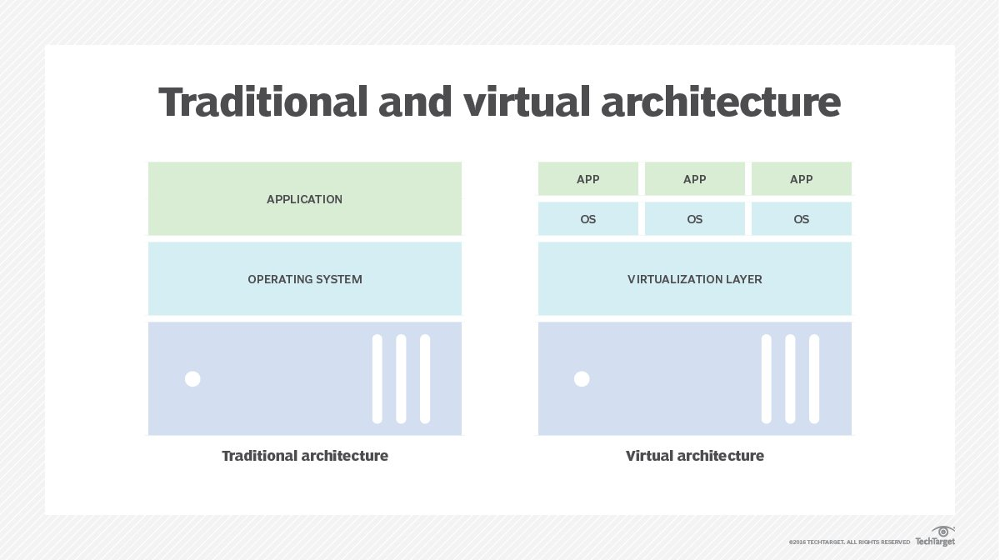

- A physical machine is a computer, like this Windows machine. It has a CPU, memory, a hard drive and a network connection. It could also be a laptop, tablet or other device. In the context of virtualization, the **`physical computer is called a host`**.

## Hypervisor

- A Hypervisor is the software layer that enables virtualization. It sits between the physical hardware and the virtual machines and is responsible for creating, managing, and allocating resources to each VM. The hypervisor controls how much CPU, memory, and storage each VM gets and ensures that the VMs remain isolated from one another. It acts as a resource manager and traffic controller for the server.
- Virtualization is the process of using hypervisor on a physical machine – the host – to create **`virtual machines also called a guest`**.

- There are two main types of hypervisors:

    - Type 1 **(Bare-metal hypervisor**): Installed directly on the physical hardware. It is more efficient and commonly used in cloud data centers.
    - Type 2 (**Hosted hypervisor**): Installed on top of an existing operating system, usually used for personal or testing environments.

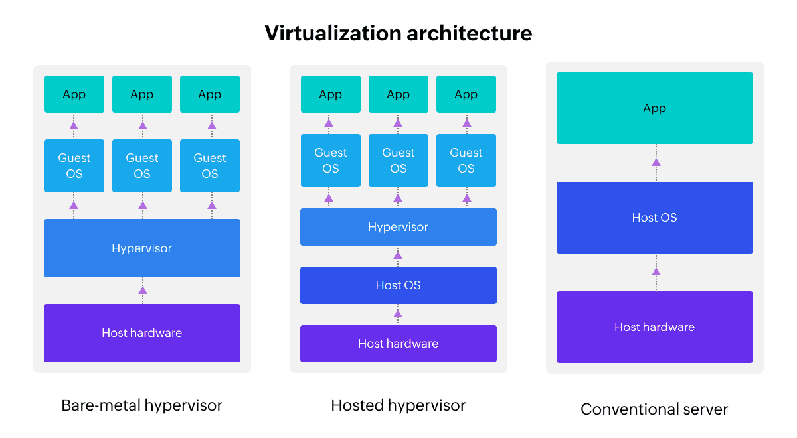

## Virtual Machine

- A Virtual Machine (VM) is a software-based computer that runs inside a physical server. It behaves exactly like a real computer — it has its own operating system, memory, storage, and applications. Even though multiple VMs may run on the same physical server, each VM operates independently and does not interfere with the others. If one VM crashes, the others continue running.
- A virtual machine is really just a file sitting on the hard drive and to users it appears and acts no differently to a physical computer. It can be configured to use any operating system with any amount of things like CPU capacity and storage space from its host. The only limit to how many virtual machines can be created and run depends on the host CPU, RAM and other resources. RAM especially is almost always the main limiting factor.
- So together, all the virtual machines share the same resources of the host, but each virtual machine works independently of each other.

## How does virtualization work?

#### 🔴 The Problem (Before Virtualization)

- Imagine a company has:
    - 1 server for Email
    - 1 server for Website
    - 1 server for Database
- But here’s the issue: Each server is only using maybe 20–30% of its capacity.
- That means: 70–80% of the server power is unused.
- But you still pay for:
    - Electricity
    - Cooling
    - Maintenance
    - Space
    - Hardware cost
- So basically: Many physical servers are running, but most of their power is wasted. This is inefficient and expensive.

#### 🟢 The Solution: Virtualization

- Instead of: 3 separate physical servers,
- You use: 1 powerful physical server and divide it into 3 virtual servers (VMs).
- Now:
    - VM1 runs Email
    - VM2 runs Website
    - VM3 runs Database
- All on the same physical machine. Now the hardware is used much more efficiently.
    - Less waste.
    - Less electricity.
    - Less cost.

- Inside that one big server, a special software called Hypervisor is installed. The hypervisor, divides CPU, RAM, Storage, Network etc. and gives portions of it to each VM. So each VM feels like it has its own computer but actually, they are sharing one real machine.

## Benefits of virtualization 

- Virtualization provides the basis for cloud services because it allows providers to optimize their resources, which enables utility pricing and on-demand services. 

#### Cost effective 

- There are obvious cost benefits of virtualization including reduced capital expenditure – less hardware’s needed because multiple virtual machines can run on a single host. And operating costs are lower because less space, power and cooling is required in the data center. 

#### Threat Isolation 

- The isolation of each guest system in a virtual environment means a problem with one guest machine doesn’t affect the others and a security attack on one guest is unlikely to affect a host machine.  

#### System back-up and recovery 

- Virtual machines are simply programs, so they can be easily copied and restored. ‘Snapshots’ enable multiple, identical copies of one virtual machine to be created so, if something happens to the system, the copy can be restored to its original state.
- The optimisation of resources through virtualization means that cloud providers can offer an efficient and safe environment, and user organisations should expect to share those benefits through a flexible and cost-effective service.

# Business Implications

## CapEx vs OpEx

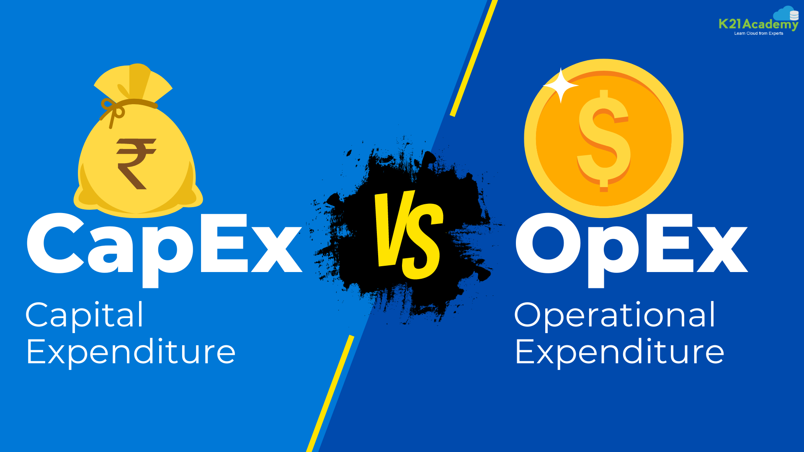

- **CapEx (Capital Expenditure)** involves large upfront investments in physical IT infrastructure, while **OpEx (Operating Expenditure)** represents recurring, pay-as-you-go costs for cloud services. 
- In CapEx, when a company runs its own data center, it must buy servers, buy storage, buy networking equipment, buy software licenses etc. These are big upfront purchases.
- 💡 Example: A company buys servers for $500,000. That money is spent all at once. The servers are treated as company assets and lose value over time (depreciation).
- So:
    - Big upfront cost
    - Long-term commitment
    - Hard to change quickly
- OpEx is like paying for usage like a utility bill. With cloud you don’t buy servers, you rent computing power, you pay monthly based on usage.
- 💡 Example: Instead of buying a server, you pay $2,000 per month to use cloud servers.
- So:
    - No big upfront investment
    - No hardware ownership
    - No depreciation
- Just monthly operating expense
- It’s like:
    - Buying a car → CapEx 🚗
    - Using Uber → OpEx 🚕
- With cloud services there are no assets to purchase so there’s nothing that depreciates over time. And, because the model allows cloud resources to be scaled up or down to meet demand, it can be a very cost-effective way of managing IT services. 

| **Context**            | **CapEx**    | **OpEx**       |
|------------------------|--------------|----------------|
| **The upfront cost** | Significant  | None           |
| **Ongoing cost**      |  Low         | Based on usage |
| **Tax Deduction**      | Over-time    | Same year      |
| **Early Termination**  | No           | Anytime        |
| **Maintenance**        | Significant  | Low            |
| **Value over time**    | Lowers       |  No change     |

- There are also very few up-front costs in the cloud, although some providers allow pre-payment for some of their services. This means an organisation commits to consuming an agreed number of resources which they pay for regardless of whether they use them or not, generally at a discounted rate. This is still counted as operational expenditure. 

>[!IMPORTANT]
> - In the cloud, when you launch a virtual machine, storage volume, database, or any other service, billing usually starts immediately and continues until you stop or delete it. The cloud provider does not automatically know whether you are actively using that server or not — it only knows that it is allocated to you, so it keeps charging for it.
> - Because cloud platforms make it very easy to create new resources with just a few clicks, employees often spin up servers for testing, development, or temporary tasks and then forget to shut them down afterward. Over time, these unused or underutilized resources continue running in the background and generate costs every hour or every month. As a result, when the monthly bill arrives, organizations realize they are paying for resources that are not providing any real value. 
> - This is why cost control and proper resource management are major challenges in cloud environments — companies must regularly monitor, optimize, and deactivate unnecessary resources to avoid overspending.

## Fixed vs Variable Cost

- In-house IT infrastructures and services are set for a period of time to meet the IT strategy requirements, organisations know their fixed costs for things like running the data center, buying hardware and software, and ongoing systems maintenance. Then there are things like periodic technology refreshes, license upgrades and support fees. These costs are generally visible and predictable.
- Cloud services are different. Because of utility pricing and on-demand resources, monthly expenditure is variable and can fluctuate. If the services are for a ‘steady-state’ application – say a customer relationship management system – with a fairly static number of users and consistent usage, the cost can be pretty well anticipated and unlikely to change much. 
- But, for applications where there’s a high variation in the number and frequency of users, the cost fluctuation will be much greater. However, cloud service providers publish price lists so it’s still possible to predict the likely costs based on forecast demand for the services. 
- So, accurately costing complex cloud deployments can be difficult, but this has to be weighed against the benefits of on-demand services and cost reductions if service requirements decrease. 

## Environmental cost

- Cloud services operate through a common infrastructure which means that multiple customers are running on the same IT infrastructure. If Customer A needs more resources at certain times, Customer B needs them at different times and Customer C has different requirements again, their combined requirements can be aggregated – along with all the other customers – so the overall provision can be ‘flattened’.
- This means that the power consumption requirements are significantly lower than if those hundreds of thousands of customers were running their own data centers.

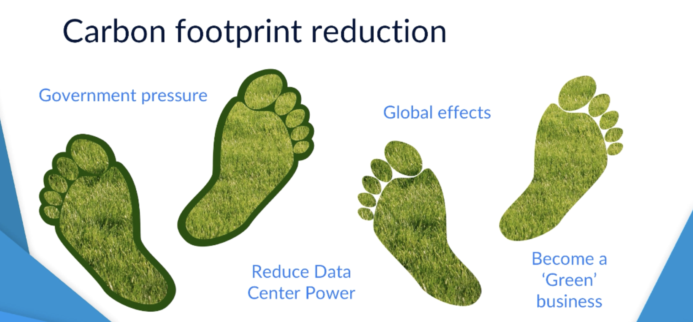

- Your carbon footprint is the total amount of pollution (carbon dioxide) your activities create. For a company, this includes:
    - Electricity usage
    - Fuel usage
    - Data center power
    - Manufacturing processes
- Carbon footprint reduction means reducing the amount of pollution your company creates.
- A green business is a company that tries to:
    - Reduce pollution
    - Save energy
    - Use resources responsibly
    - Protect the environment
- Governments around the world are asking companies to reduce pollution and become more environmentally friendly. Running big data centers (rooms full of servers) uses:
    - A lot of electricity
    - A lot of cooling systems
    - A lot of power
- All of this creates carbon emissions, which contribute to climate change. Now, instead of running your own data center, if you move your applications to the Cloud, the cloud provider can run them more efficiently.
- Cloud companies:
    - Use better technology
    - Use energy more efficiently
    - Invest in modern cooling systems
    - Sometimes use outside air to cool servers (less electricity needed)
- So by moving to the cloud, your company:
    - Uses less energy overall
    - Reduces pollution
    - Becomes more environmentally friendly
- And being environmentally responsible improves your company’s reputation.

## Reduce Risk

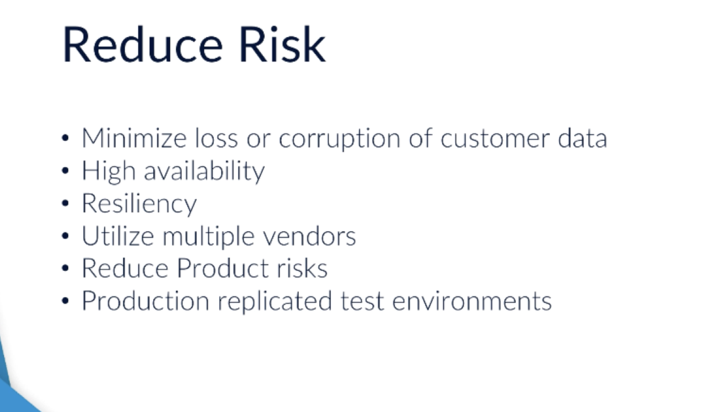

- Utilizing the Cloud allows you to reduce many of your business risks. One of your biggest risks is that of data durability, the loss or corruption of your own, or even your customer's, data. It provides high availability, resiliency and this will help with reducing that risk. However, you could even take this one step further, and utilize multiple Cloud vendors. Perhaps both AWS and Azure to hold customer data as an even greater risk mitigation strategy.
- Product risks often come when moving from test and development to production. Much of this is down to the fact that it's not always easy to replicate your test environment to reflect that of your production when on-premise. Largely, this is normally down to not having enough available resources. As a result, tests are often not completed to full requirements of a new product or service.
- With Cloud deployments, there are services that allow you to have the ability to copy your architecture exactly as it is in production, which can then deploy for testing where it's built exactly the same. You can have this purely for the period only required for testing, and then remove the infrastructure so you stop paying for it. So now, you're able to fully test, from end to end, as if it were in a production environment for a small cost, mitigating a lot of the existing risks you would have had otherwise, resulting in a more reliable release for your customers.

# Security and Legal Implications

- **`Cloud security is a shared responsibility between the service provider who’s accountable for the ‘security of the cloud’ and the customer organisation who’s accountable for the ‘security in the cloud’`**.
- Before organisations move all or part of their IT services into the cloud, they must be confident in the security arrangements. These can be affected by the infrastructure they’re using, how their systems are accessed and how their data is handled. So, the cloud provider must provide assurance and certifications to prove how they enforce security, and the customer organisation then needs to implement appropriate security measures and processes.
- The provider secures the underlying infrastructure such as physical data centers, networking, hardware, and hypervisors, while the customer must secure their applications, data, user access, and configurations. Before moving to the cloud, organisations must ensure that proper security certifications, compliance controls, and legal protections are in place.

## Compliance controls

- Under Security of the Cloud, the provider manages infrastructure security, physical access controls, and compliance with global regulations.
- With cloud services, the provider is accountable for meeting some of these legal requirements, specifically the elements geared toward physical access to the infrastructure. Cloud providers must adhere to many worldwide compliance regulations – here are a few of the major ones:
    - Health Insurance Portability and Accountability Act (HIPAA) : Protecting electronic health information in the US
    - General Data Protection Regulations (GDPR) : Data protection law in the EU and UK focusing on data privacy and protection by design
    - Payment Card Industry Data Security Standard (PCI-DSS) : Security standards for handling payment card information
    - International Standards organisation (ISO) : Information security management standards
- While the cloud provider ensures compliance related to physical infrastructure and system-level controls, customer organisations still remain responsible for how they use and manage data within the system.  

## IT infrastructure

- Cloud infrastructure typically runs on **shared environments (multi-tenancy)** to reduce cost, but **highly sensitive data workloads can use dedicated hosts** for greater isolation at a higher cost. Providers implement strong multi-layered security controls at the host and hypervisor levels to prevent cross-tenant risks.

## Data integrity and durability

- Cloud providers offer a number of features to maintain the security and integrity of the data they process. These include:

1. **HTTPS encryption** - Enforcing https-based communication so data is encrypted in transit. This means the cloud provider will provide data transfer appliances with multiple security features for the organisation to fill with data which is then encrypted and securely transported back to the cloud provider.

2. **TLS** - Configuring communications between the virtual machines running in the cloud to use Transport Layer Security, or TLS; a widely adopted security protocol designed to facilitate privacy and data security over the Internet.

3. **SSE** - Using server-side encryption, or SSE, to support the encryption of data when it’s being stored. They use what are known as ‘key hierarchies’ to do this so that, even if somebody was to gain access to the physical media storing an organisation’s data, they won’t be able to get to the master key that’s required to decrypt it because it’s stored somewhere else.

4. **Access Controls** - Fine-grained access controls which require authorisation for users to access data. organisations can control who can access data stored in their storage services.

5. **Object Versions** - Object versioning which enables versioning on storage services. This means a malicious or accidental overwrite or deletion can be ‘rolled back’ to the previous version. When an organisation uploads something to the cloud, multiple copies of the resource are placed into multiple storage servers in multiple physical locations. This ensures a high degree of durability, and recovering data if something fails with the storage systems is fairly easy. Most cloud providers state 99.999999999% - known as ‘eleven nines’ – durability of their storage service which means if you stored ten million objects for ten thousand years, they might lose one of them! 

## Identity and Access Management (IAM)

- Under Security in the Cloud, the customer organisation remains responsible for managing Identity and Access Management (IAM), enforcing the **principle of least privilege**, securing applications, configuring systems properly, and ensuring regulatory compliance. Cloud providers may integrate with existing authentication systems, but organisations must still define who can access what resources and under what conditions.
- This means limiting access rights for users to the bare minimum they need to perform their work. 

## Contracts and SLAs (Service Level Agreements)

- A Service Level Agreement (SLA) in cloud computing is a formal, **legally binding contract between a cloud service provider (CSP) and a customer that defines the expected level of service**, including reliability (e.g., 99.9% uptime), performance metrics, security, and specific penalties or credits if these standards are not met
- An SLA (Service Level Agreement) is a formal promise written in a contract between a service provider and a customer. It clearly defines:
    - What service will be provided
    - How well it will perform
    - How available it will be
    - What happens if the service fails
- Think of it like a **guarantee card for a service**.
- Example: If your provider says, “We guarantee 99% network uptime per month,” that promise is part of an SLA. If they fail, you may get compensation or service credits.
- In cloud computing, an SLA is the agreement between you (customer) and the cloud provider (like Amazon Web Services, Microsoft Azure, or Google Cloud).
- Since your applications and data run on their infrastructure, they promise certain performance standards.

1️⃣ Availability (Uptime Guarantee)

- This is the most important part. Cloud providers usually promise something like:
    - 99.9% uptime
    - 99.99% uptime
    - Sometimes even higher
- For example:
    - 99.9% uptime means about 43 minutes of downtime per month
    - 99.99% uptime means about 4 minutes of downtime per month
- If the service goes down more than promised, you may receive service credits.

2️⃣ Performance & Capacity

- The SLA may define:
    - Response times
    - Compute performance levels
    - Storage durability guarantees
- For example:
    - Storage durability may be promised at 99.999999999% (11 nines).
    - API requests will respond within a specific time.

3️⃣ Issue Resolution

- SLA also defines:
    - How quickly support will respond
    - Priority levels for incidents
    - Time to fix critical issues
- Example:
    - Critical issue → response within 1 hour
    - Normal issue → response within 24 hours

4️⃣ Compensation Terms

- If the provider fails to meet SLA terms:
    - You may receive service credits
    - Rarely direct financial penalties
- Important: Usually, you must claim the credit — it’s not always automatic.
- Contracts and Service Level Agreements (SLAs) play a critical role in cloud security and reliability. SLAs define guarantees around availability, performance, capacity, and issue resolution timelines.
- If the customer organisation doesn’t think the SLAs support their contractual agreements, they might need to architect their systems to be more fault tolerant and be supported by new SLAs. However, this is likely to cost more for the additional resources, so it’s a case of balancing infrastructure and service requirements with security and continuity requirements.

# Application Mindset & Practices

- Traditionally, in a physical data center, companies first build the network, buy hardware like servers and storage devices, and then install applications on top of that hardware. Because everything depends on physical machines, IT teams think in terms of “this server” or “that hardware.” If something breaks, the faulty server must be removed, checked, repaired, and then put back into use. Hardware is treated as something long-term and permanent.
- In the cloud, things work very differently. Networks, servers, and other resources are not physical machines you can touch — **they are created using scripts (code)**. This is often called **Infrastructure as Code**. That means the entire setup — networks, virtual machines, storage — can be written in a file and recreated anytime. Instead of thinking of a server as a permanent machine, we think of it as software that can be created or deleted whenever needed.
- If something fails in the cloud, you usually don’t repair it like traditional hardware. Instead, you simply delete (terminate) the faulty resource and run the script again to create a fresh one. It’s faster, cleaner, and more automated.
- For many IT professionals, this requires a big mindset shift — from maintaining and repairing physical hardware to automatically creating and recreating resources using code.

## Planning for failure

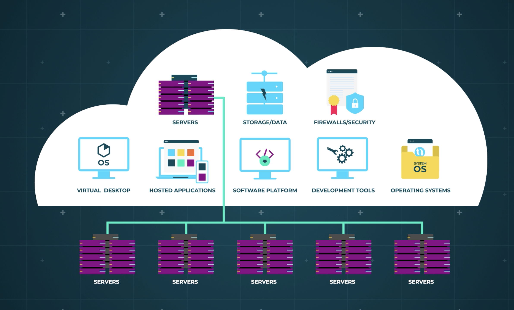

- Planning for failure in the cloud means accepting one important truth: *`failures will happen`*. Cloud providers run millions of servers for hundreds of thousands of customers. At that massive scale, hardware failures, network issues, or software **problems are unavoidable**. Even if your system doesn’t fail often, good cloud design assumes that something, somewhere, will eventually break. So instead of trying to prevent all failures, we as a consumer must design system that continues working even when parts fail. This is called **service resilience**. It means avoiding a single point of failure — a situation where one broken component brings down the entire system. For example, instead of running your website on one powerful server, you run it on two or more smaller servers. The cost per hour may be similar, but if one server crashes, the other keeps the application running. Your service may slow down slightly, but it won’t completely stop.
- Some cloud services handle this automatically. For example, cloud storage services usually store multiple copies of your data in different data centers at the same time. That way, even if one data center fails, your data is still safe. But for other systems, like **application servers or databases, you as a consumer may need to design this redundancy yourself using the cloud provider’s tools**.

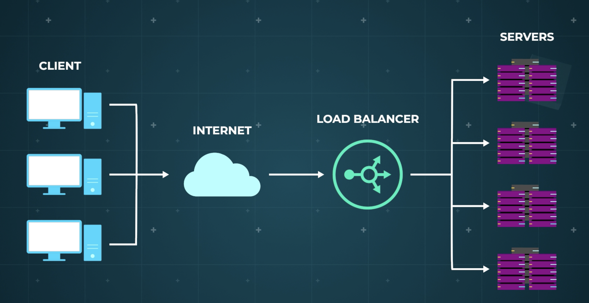

- One important tool is a **load balancer**. A load balancer acts like a traffic controller in front of your servers. When users visit your website, the load balancer distributes their requests across multiple servers so that no single server gets overloaded. If one server stops working, the load balancer automatically sends traffic only to the healthy servers. And when you add a new server, it immediately starts receiving traffic without manual intervention.

## Loosely Coupled

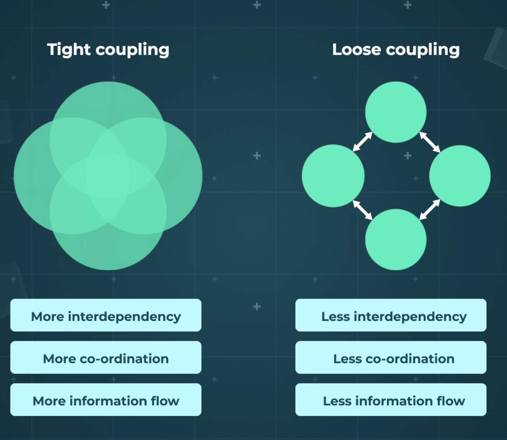

- To make failover easier, cloud systems are designed to be **loosely coupled**. This means different parts of the system don’t depend too tightly on each other. For example, instead of one server needing to know the exact network address of another server, they communicate through named services or service discovery systems. That way, if a server fails and a new one is created, the system continues working without needing manual reconfiguration. This flexibility is a key advantage of cloud design.

## Version Upgrade

- Cloud providers usually offer modern and up-to-date versions of operating systems and software. While this is generally beneficial, it can create challenges for organizations that still depend on older versions of applications or databases. 
- Moving from an outdated system to a newer version may require code changes, testing, and adjustments. So before migrating to the cloud, companies must confirm that their required software versions are supported. Sometimes upgrading is simple, but sometimes hidden compatibility issues make it more complex than expected.

>[!IMPORTANT]
> - As a cloud consumer, when you are architecting your cloud design, you must adopt a different mindset compared to traditional data centers.
> - Cloud design requires a mindset shift: instead of preventing failure at all costs, we assume failure will happen and build systems that automatically recover and continue running.

# Migrating to The Cloud

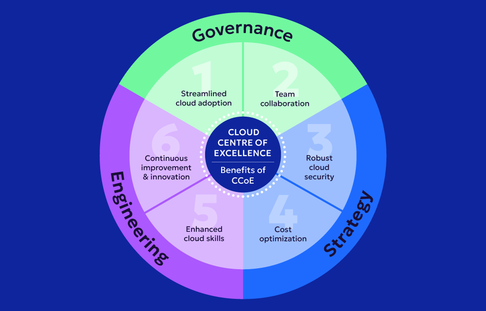

- A **Cloud Centre of Excellence (CCoE)** is basically a small expert team inside an organisation that helps everyone move to the cloud properly. Moving to the cloud is not just about changing technology — it’s about changing how people work. Cloud environments move fast, use automation, and often follow **Agile and DevOps practices**, which means teams must collaborate more, work faster, and be comfortable with continuous change. For many organisations, this mindset shift is actually harder than the technical migration itself. The Cloud Centre of Excellence exists to guide this change.
- This team is usually made up of people from different departments — IT, security, finance, operations, and sometimes even business teams. Their job is to **define the cloud strategy, set governance rules, create best practices, and guide other teams on how to migrate and operate in the cloud**. They decide things like how resources should be created, what security policies must be followed, how costs should be controlled, and which cloud technologies should be used. Organisations that create this team usually succeed more in their cloud journey because they have a clear direction instead of letting every team do things differently.
- For example, imagine a company in Mumbai that wants to move its systems from an in-house data center to the cloud. Without a Cloud Centre of Excellence, one team might use one cloud service, another team might configure security differently, and costs might grow out of control. But if a Cloud Centre of Excellence is guiding them, it will define standard templates, security rules, naming conventions, and cost monitoring practices so that everyone follows the same structure.
- When migrating to the cloud, organisations usually start small. They might begin with a simple project like moving a static company website to understand how cloud deployment works. Before starting, employees must be trained. Many migrations fail not because the technology is bad, but because users don’t understand how to use it. **`Training both IT teams, end users (internal business users) or Support team is critical`**.
- These are:
    - HR team using payroll software
    - Sales team using CRM
    - Finance team using accounting tools
    - Developers using internal platforms
    - Support staff using ticketing systems
- These people may not be technical, but they use business applications daily. When systems move to the cloud, their login methods, interfaces, workflows, or security processes may change — so they need training.
- External customers (like customers/client users of your website or app) are generally not referred to as “end users” in migration discussions — unless the migration changes how they interact with your product (like a new UI or authentication system).

## 6 R's

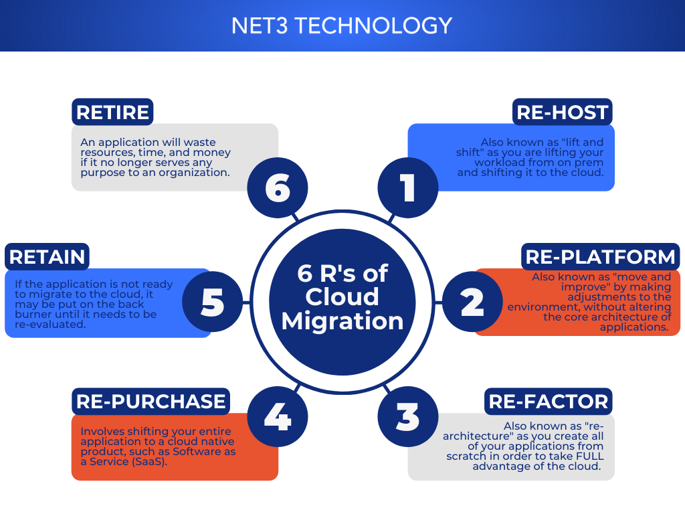

- There are different ways to migrate applications, often described as the **6 R's**.

### 1️⃣ Re-host (“Lift and Shift”)

- What it means: Move the application to the cloud without changing its architecture. You basically copy your existing server setup into cloud virtual machines.
- When to use it:
    - You-need to migrate quickly.
    - You don’t have time to redesign.
    - You want to exit a data center fast.
    - The application works fine as it is.
- Example: A company runs a payroll system on Windows Server in their data center. They move that same system to cloud virtual machines without changing anything.
- Benefit: Fast and simple.
- Limitation: Doesn’t fully use cloud advantages.

### 2️⃣ Re-platform (“Lift and Reshape”)

- What it means: Move the application to the cloud but make small improvements. You don’t rewrite the app, but you optimize certain parts.
- When to use it:
    - The current version isn’t supported in cloud.
    - You want small performance or cost improvements.
    - You want moderate effort but better results than lift-and-shift.
- Example: Instead of running your database on a self-managed VM, you move it to a managed cloud database service.
- Benefit: Better performance and reduced maintenance.
- Limitation: Some changes required.

### 3️⃣ Repurchase (“Drop and Shop”)

- What it means: Replace your existing application with a SaaS solution.
- When to use it:
    - Your application is outdated.
    - A better SaaS product already exists.
    - You don’t want to manage infrastructure anymore.
    - Maintenance cost is high (Total cost of owning and managing the application yourself)
- Example: Replacing an in-house CRM system with Microsoft Dynamics 365 or Salesforce.
- Benefit: No maintenance, modern features.
- Limitation: Data migration and user training required.

### 4️⃣ Refactor (“Re-architect” or “Code and Load”)

- What it means: Rewrite or redesign the application to fully use cloud-native features. This is the most cloud-optimized approach.
- When to use it:
    - The application is business-critical.
    - You want scalability, automation, and microservices.
    - You want maximum long-term benefit.
- Example: Breaking a large monolithic application into microservices and deploying them using containers and managed services.
- Benefit: Best scalability and cost efficiency.
- Limitation: Time-consuming and expensive initially.

### 5️⃣ Retain (“Keep and Weep”)

- What it means: Keep the application as it is (don’t move it).
- When to use it:
    - It depends on special hardware.
    - It handles extremely sensitive data.
    - It will be retired soon anyway.
    - Migration cost is too high.
- Example: A legacy manufacturing control system that runs on proprietary hardware.
- Benefit: No migration effort.
- Limitation: Still managing old infrastructure.

### 6️⃣ Retire (“Drop and Stop”)

- What it means: Shut down the application completely.
- When to use it:
    - Nobody uses it anymore.
    - A duplicate system exists.
    - It no longer adds business value.
- Example: An old reporting tool that was replaced years ago but still running.
- Benefit: Saves cost immediately.

- After migration, the journey doesn’t stop. The cloud constantly evolves — new features, services, and pricing models are introduced regularly. Teams must stay updated. Even though hardware maintenance is handled by the cloud provider, organisations still need to manage operating systems, security, backups, monitoring, and user access depending on whether they use IaaS, PaaS, or SaaS. The advantage is that many tasks can now be automated. For example, if a server behaves abnormally, a monitoring system can automatically remove and replace it.

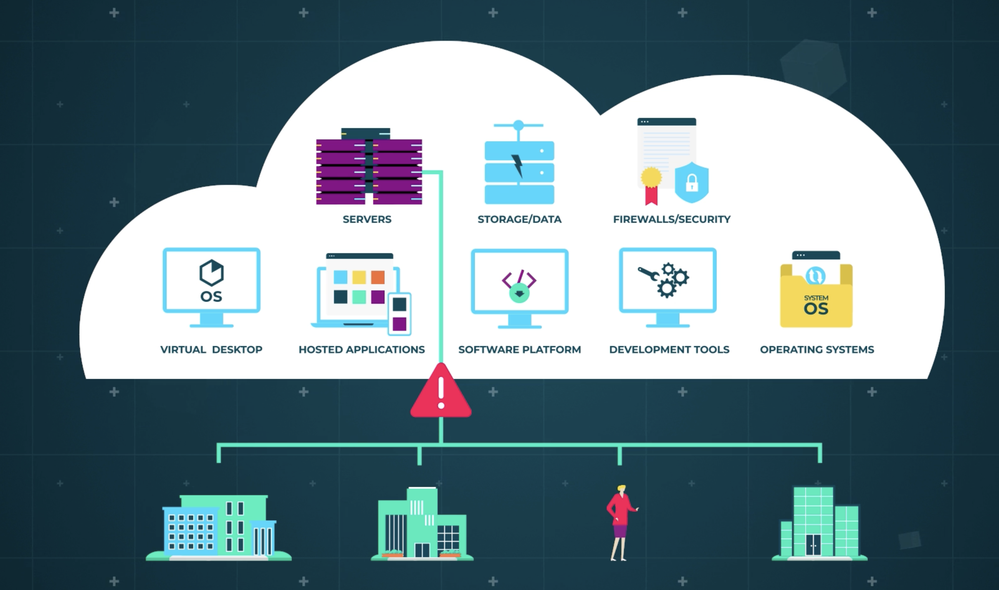

## Optimisation

- Finally, optimisation becomes important. Just because something runs in the cloud doesn’t mean it’s efficient. Over time, organisations may replace virtual machines with managed services, automate repetitive tasks, or reduce unused resources to save costs. The Cloud Centre of Excellence continues to guide these improvements, and over time its role becomes more like an internal consultant helping teams use the cloud better.
- In simple terms, a Cloud Centre of Excellence is the guiding brain of a company’s cloud journey — helping with strategy, migration, training, governance, and continuous improvement — while ensuring people, not just technology, adapt successfully to the cloud.

# Technical Q&A Notes

1. **Which areas are the sole responsibility of the customer for SaaS, PaaS, and IaaS services?**
    
    A. Devices (Mobile and PCs) ✅

    B. Information and data ✅

    C. Physical network

    D. Physical security of the data center
    

    - *Explanation:*
        - *The correct answer is Devices (Mobile and PCs) and Information and data.*
        - *The customer's responsibility is the security of the client device that is being used by customers (mobile device, PC, etc.) to access cloud applications.*
        - *Data protection is the responsibility of the customer, although the customer can use some cloud services to help protect its data.*
        - *In the SaaS, PaaS, and IaaS service models, the physical network is the responsibility of the CSP.*
        - *The pysical security of the data center is handled by the CSP in the IaaS model in the PaaS and SaaS models.*

2. **One can argue that security on the public cloud is superior to on-premise security. Why is this?**

    A. Public cloud vendor services must meet international security requirements. ✅

    B. Public cloud vendor services must meet multiple business industries' security and governance requirements. ✅

    C. Public cloud vendor datacenters use superior security technology.

    D. Public cloud vendor services are entirely separate from the public internet.

    - *Explanation:*
        - *Security is one of the most discussed topics within cloud computing, and many enterprises still have concerns over how secure it is.*
        - *However, public cloud vendors such as AWS and Microsoft Azure are considered to be more secure than your own data center. This is down to the fact that they have to adhere to global compliance programs across multiple industries and by applying the shared responsibility model.*

3. **Public cloud vendors have a common definition of what aspects of security are the vendor's responsibility and what aspects of security are the end user's responsibility. This is referred to as the Shared Responsibility Model. Under the Shared Responsibility Model, which of the following would be the end user's responsibility?**

    A. Access to the physical datacenter

    B. Operation and administration of the hardware hosting virtual resources

    C. Availability of a cloud storage service

    D. Identity and access management to a cloud database ✅

    - *Explanation:*
        - *The correct answer is Identity and access management to a cloud database.*
        - *The vendor will operate to an exceptionally high standard of security for the underlying infrastructure of the cloud, but it's up to you as the end-user to then architect security in the cloud by using the tools, services, and applications available.*

4. **Which service model allows you to configure and customize everything in your environment except the hardware?**

    A. Software as a Service (SaaS)

    B. Infrastructure as a Service (IaaS) ✅

    C. Platform as a Service (PaaS)

    D. ‘Anything’ as a Service (XaaS)
    
    
    - *Explanation:*
        - *The correct answer is Infrastructure as a Service (IaaS).*
        - *IaaS provides the greatest level of customization as you can configure the environment from the ground up, starting from which operating system to install and up. Other service models have fixed components which you are unable to change or manage.*

5. **Which cloud service model balances customization and user control so developers may focus on the application layer while the service administers the virtual architecture, such as the operating system?**

    A. Infrastructure-as-a-Service

    B. Platform-as-a-Service ✅

    C. Software-as-a-Service

    D. Traditional on-premise

    - *Explanation:*
        - *The correct answer is Platform-as-a-Service.*
        - *A PaaS cloud service model allows access to the framework above the operating system level, which is ideal for developers who want to focus on their application design while the service itself manages a large portion of the day-to-day service administration.*

6. **What is a key benefit of Virtualization?**

    A. Increased operational cost

    B. Quicker remote connectivity

    C. Reduced network latency

    D. Reduced capital expenditure ✅

    
    - *Explanation:*
        - *The correct answer is Reduced capital expenditure.*
        - *As Virtualization allows for multiple VMs to be installed on the same physical host, it maximizes the optimization potential and reduces the requirement to purchase additional servers, resulting in a reduced capital expenditure*
